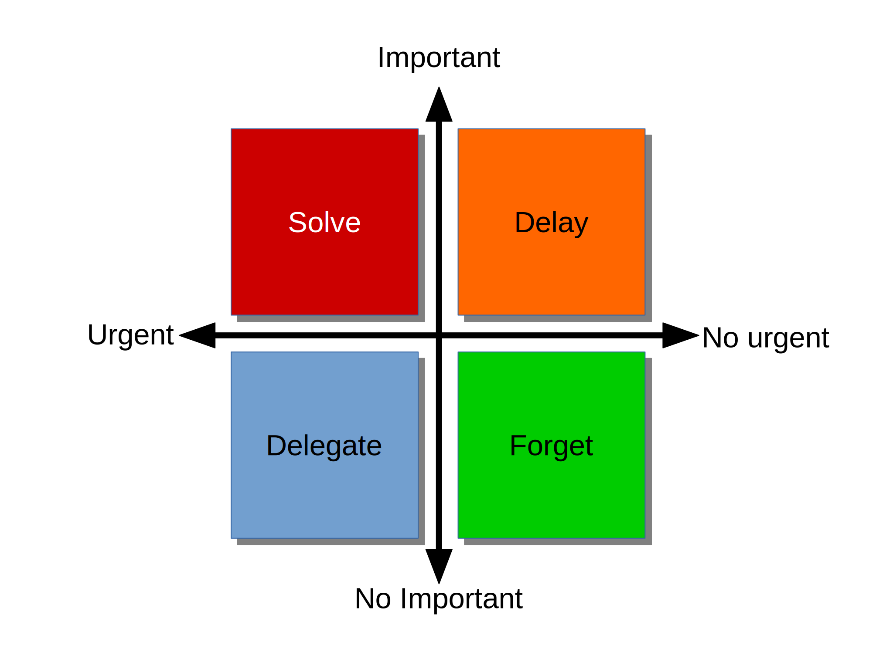



_First of all, sorry for my English. Any correction is well received._

There are two main trends in the types of `Product Owner`:

1. The more canonic case: there is a customer taking the `Product Owner` role. And of course, considering that the customer can be from your company or from other.
2. And where a person (most cases I know with this option usually a Project Manager) with direct relationship with the customer, collects the needs and takes the role of `Product Owner` facing the development `Team`.

If we were in an `Utopian World` and we had to write a letter to Santa Claus or the Three Wise Men to ask the classic `Product Owner` (the one mentioned in the first case), we could have something like this:

    Dear Santa:

    I want a Product Owner(PO) for the software product that my company is developing, but not one of the lot.

    I want that my product owner is a person who has a very clear vision of the product being developed. PO has to have sufficient time to realise a number of tasks such as:

    - Define the product vision.
    - Clearly transmit that vision to business team.
    - Clearly transmit that vision to the development team.
    - Mark Product Roadmap.
    - Define the Product Backlog, writing and prioritizing: Epics, User Stories ...
    - Facilitate user stories for the current Sprint and for at least the next period.
    - Maintaining the Product Backlog, modifying, re-prioritize, re-writing, etc.
    - PO has to define acceptance criteria.
    - PO has to participate in the Sprint Planning meeting.
    - Maintain relations with stakeholders.
    - Collaborate closely with the Scrum Master.
    - Blah blah blah

And of course, after this enumeration we can see that to be `Product Owner` means to have much power, and you know that:

> With great power comes great responsibility. (Ben Parker, Uncle Ben, Spiderman's uncle)

[Spiderman's image source](http://en.wikipedia.org/wiki/Spider-Man)

I know it is not easy to have a `Product Owner` with all the features that I am talking, there are even times when it is impossible. But, we can expect from our `Product Owner`, that it isn't a superhero, is that he/she has a minimum features (skills and attitudes) to try to make a successfull product in a `Real World` not in an `Utopian World`:

* PO must have the necessary skills, be qualified for the job and have the time necessary to respond for the position.
* Maintain `Product Backlog` with at least the needed stories for the next `Sprint`.
* Clearly define `User stories` (I will write a special post for this). To do this there are some important points:
    + Remember: _"As a \_\_ I want to \_\_ so that I \_\_"_
    + Put love in writing, strive to leave no ambiguities and finally write concise texts.
    + **Describe what you want, not how you want it**. "What" is territory and responsibility of `Product Owner`, but "How" should be the `Team` in charge of carrying out (It is true that not everything is black or white and there is gray. There are times that is inevitable to say part of "how". For example, the obligation to use free software without cost or vice versa, the obligation to use a particular product by contractual imposition of the company).
    + Define acceptance criteria for this story. This is important for developing tests and where it would be an entry point of tasks for the possible `QA` team.
* PO has to delegate and trust the `Team` not overwhelm them and wait until the end of the` Sprint` to see the results.
* Avoid or at least minimize the incorporation of new stories in the current `Sprint`. So we aren't in the `Utopian World`, we know that there are emergencies, occurrences of bugs, etc. but we should identify also the urgency and the importance and act accordingly, for this it is always useful to remember this matrix:

* And above all don't let be corrupted by the power position and don't be invaded by [god complex](http://en.wikipedia.org/wiki/God_complex). It is impossible to have all the answers and all knowledge, you have to share your doubts, seek advice and listen to others.

Whenever we speak of `Scrum Master` as a servant leader, but also the` Product Owner` must have that spirit. The `Team` is there to give you what you want, to suit your needs, so you should openly collaborate with them by giving all possible facilities. **Among the `Team` and the `Product Owner` should be mutual trust**, without this is very complicated achieve success.

The `Product Owners` that you know... Do they update the` Product Backlog`? How are their writing of `User Stories`? Is there mutual trust between the `Product Owner` and the `Team`?

