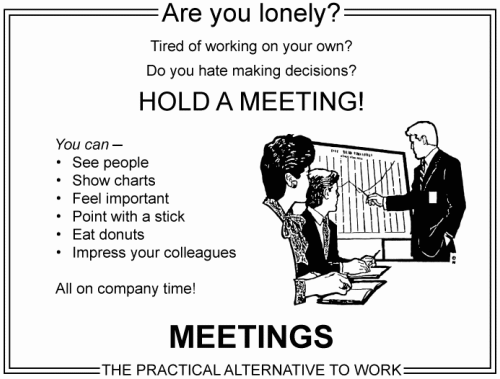



_First of all, sorry for my English. Any correction is well received._

### Meetnaping
> (n.) the tendency to kidnap a colleague by forcing him to attend a useless meeting.

A meeting, if we stick strictly to the dictionary, would not lead to anything more than get an _assembly of gathered people_.

The fact is that in the workplace, the meetings become a necessary and useful tool ... but only if it used in the right way and for that, there are a number of guidelines or principles that can help us to achieve useful meetings:

#### 1. **Time**: Meetings should not last more than an hour.
* Our mind is limited and can not be focused for extended periods of time.
* If it is necessary you can take a break, although the ideal is to focus the purpose of the meeting as much as possible to be concise and to minimize the time required.

#### 2. **Target**: Every meeting must have in advance a clearly defined goal.
* Defining the purpose of the meeting in convening it will allow attendees to prepare the meeting in an appropriate manner.

#### 3. **Preparation**: Each participant must carry out their duties before going.
* Each participant must study and prepare the information needed to achieve the target set for the meeting objective.
* Doing this you will not waste time on contextualization and searching of information during the development of the meeting.

#### 4. **Concentration**: Delete, except urgent need, the presence of smartphones, tablets, laptops or similars.
* Each participant must, **although only be for education**, be aware of the meeting and not be distracted by trivial things at his phone or his laptop, hence it is suggested not to go with them unless extreme necessity.
* And if necessary their presence to be available, you must minimize as much as possible the consultation and use of the terminals.

#### 5. **Summary**: End the meeting with a list of things to do.
* Summarize the tasks to do in a list validated by all attendees.
* It would be equivalent to validate a meeting minutes but being more concise and practical.

If we do not pay attention to these points we risk wasting time and in a meeting the time lost is not only yours. You also lost the attendants's time.

We must be generous and productive. **Please only convene necessary meetings.**

Unfortunately, almost all know cases of people who takes refuge in meetings to justify their work.

However, if these _professional meetingers_ only make meetings themselves would not affect the rest of us. But it is not, the biggest problem is that this scar drags other because this type of people usually are also specialists in _meetnapings_. So we will end as we began, with the definition:

### Meetnaping
> (n.) the tendency to kidnap a colleague by forcing him to attend a useless meeting.

And you? Do you create useful meetings with a clear goal? Have you been the victim of some _meetnaping_? Do you have any suggestion for useful meetings?

