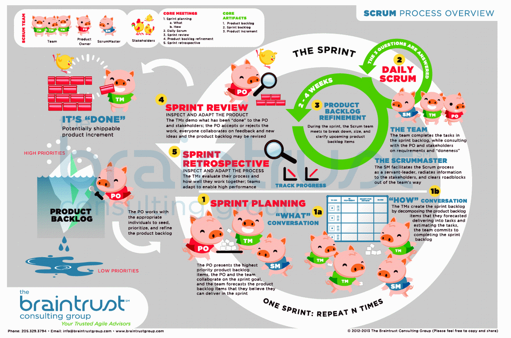
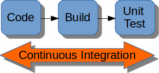
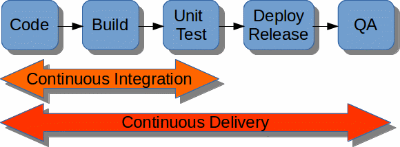
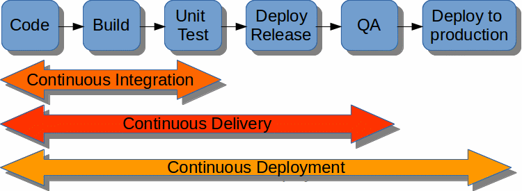



_First of all, sorry for my English. Any correction is well received._

`Continuous Integration`, `Continuous Delivery`, `Continuous Deployment`... ¡Continuous Everything!

**A sumun in agility could be: minimize as much as possible the time between the birth of a task, such as developing a new functionality, and the availability of this functionality in a production environment**.

But getting to that point is important to have traveled a path that will lead us in a natural way to that situation. **As an analogy we can think of [the importance of crawling](http://www.babble.com/baby/crawling-is-crucial/) before walking**. Crawling is not required, but it is strongly recommended because it serves to strengthen lot of things in the baby's development. Similarly, **if we want to have an agile team for our development product, it should start with less ambitious targets**. Change the way you work implies an adaptation time because we all are [reluctant to change](http://lifehacker.com/5982622/why-youre-so-afraid-of-change-and-what-you-can -do-about-it).

I'm going to use an example to develop my explanation of how you can evolve as naturally and smoothly as possible, from the most canonical `Scrum` to a development mode as agile as possible using Kanban, giving accommodate to the movement `#NoEstimates` and get what we call `Continuous Everything`:

### 1. Inception

We are developing our software product but we do so in a agile way, creating the minimum viable product, and we decided to use `Scrum`.

Do not forget that we are incorporating into our company an agile methodology, it is a change of mentality that all assets of the company must internalize so the best thing is to gird to the corset of `Scrum` as much as possible: Make every meeting, to estimate tasks , be strict with the times of the `sprints`, etc.

There is much literature on `Scrum`, so I will not go into detail, so I just pointed a few things:

* The `product owner` maintains the `product backlog`, a list of user stories sorted by priority.
* We mark a period of time called `sprint` for the development of new functions (to start with a common value: 4 weeks).
* At the beginning of this period the tasks that you can perform at that time (`sprint backlog`) are identified and the development team estimates the time needed to implement them.
* After each iteration we will have an increase of the product, a usable product although partially.
* The few or many developed functions must be fully operational by giving value to the product.
* The functions that are not completed will not be taken into consideration.

This scheme can help to get a better idea of the `Scrum` methodology:

[Image source](http://braintrustgroup.com/product/scrum-process-poster-24-x-36/)

Well, the fact is that some `sprints` (development periods) pass and we already feel "agile", between a sprint and another the `Product Owner` can correct the course that takes the product if the result does not convince him.

In addition, the development team has some tools for development as a control version system (eg `git`).

But the number of lines of code grow and technically we want to go further...

### Continuous Integration

> (wikipedia) "is the practice, in software engineering, of merging all developer working copies with a shared mainline several times a day... The main aim of CI is to prevent integration problems."

We decided now to incorporate an application as: `Bamboo`, ` Cruise Control`, `Jenkins`... in order to have a `Continous Integration`.

With these tools, every commit of our code to the control version system shoots automatically the compiling of the affected code, and they also help us to implementation and validation of tests.

Perfect, we are more agile to detect problems in the compilations, in dependencies between components, finding bugs, etc.

But taking advantage that we have `Jenkins` (specifying a particular application) we still want to go further...

### Continuous Delivery

> (wikipedia) "is a software engineering approach in which teams keep producing valuable software in short cycles and ensure that the software can be reliably released at any time."

We are not satisfied with that unit tests are executed automatically. Now we want to prove that our product:

* It is deployed correctly.
* Functional and integration tests that certify the quality of the platform are passed correctly.
* If the above two points are verified, then we have a version of our product that could be deployed in production.

But we still want more and we go further...

### Continuous Deployment

We can consider that the `Continuous Deployment` is an extension of the `Continous Delivery`.

`Continuous Deployment` takes us a step beyond the `Continuous Delivery`: Every change that successfully overcomes the automatic tests can automatically deploy in production.

It seems that technically we have everything automated, but now we can go a step further in the management ...

### Continous Everything

Well, now after the end of each sprint (4 weeks) we perform the whole process automatically... but why wait when we have all the steps automated?

At this point, we can ask to leave behind `Scrum`, it has helped us to be disciplined and the whole company is concienciada an agile philosophy. We can reduce the `sprint` duration in a first step until we decide to dispense with the use of` Scrum` because now, perhaps **It's time to walk and even run! (`Kanban` + `#NoEstimates`) and we can leave behind crawling (`Scrum`).**

We are technologically so advanced that a change in the code can be seen in production very quickly, only if it have successfully gone through all stages.

Customers will quickly have bug fixes, new features, improvements ... available in the production environment.

But for this we must be aware that the product has to be very mature, the team must be perfectly coordinated and trained, and have to spend enough time to reach this point of operation where you can manage everything using a board `Kanban`, and [considering 4 things](http://www.everydaykanban.com/what-is-kanban/), in which tasks are queued by priority and each team member will take the highest priority task when you have finished your previous task.

At this point the movement `# NoEstimates` has sense (In another post maybe you devote more time to the [`#NoEstimates` movement]http://ronjeffries.com/xprog/articles/the-noestimates-movement/), but that will be another war as there are many nuances, I share some and others not). Because at this point, why estimate? the tasks will be made as soon as possible by priority and they will be available in production automatically. Even we can make several deployments to production per day.

I want to incide that this process will take several months, years ... is not something that will be immediate, we must go step by step, automating the tasks as much as possible and adapting the type of management to the situation where you are in each time.

What do you think? Do you think that the `Continuous Everything` is interesting? What level of automation has your organization?

