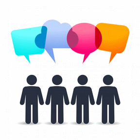



_First of all, sorry for my English. Any correction is well received._

The hashtags with the format #No*X* (#NoEstimates, #NoProjects, etc.) are trendy and are mainly used in order to grab attention and create controversy.

It is quite clear that talk negatively about anything generates more debate and controversy than speak well but, why do we reach the point of denying a *X* practice?

There are two main reasons that lead us to demonize something:

* Because we do not understand.
* Because we failed using it.

What I am mentioning is usually associated with the second alternative, but that one would have failed using *X* implies that *X* is not valid and then you have to discredit him? Well, my position is clear: no.

> "Everybody is a genius. But if you judge a fish by its ability to climb a tree, it will live its whole life believing that it is stupid."" (Albert Eistein)

It's possible that *X* isn't what you need and for this reason it doesn't work in your case, because each case is different.

Anyway, for me, without a doubt, the biggest problem of these #No*X* comes on the heels of the first part: "NO". It is i impossible translate more negativity with less, just 2 letters that anticipate an opposition, a contrary positioning of *X* but ... what do they provide?

**These hashtags that are negative from the root, they often come accompanied by destructive comments. Are these complaints usefull? what really matters is to add value, provide real and practical alternatives to substantiate an idea**, you can have more or less sense and you can agree (more or less). After all, what you should look for is add.

But I always like to say something: in this world, things are not black or white, there are many nuances between colors, and therefore, any position may be partly right, depending on your environment, your situation, the circumstances:

> "I am I and my circumstance". ([José Ortega y Gasset](https://en.wikipedia.org/wiki/Jos%C3%A9_Ortega_y_Gasset))

We can not be categorical in the vast majority of the issues that we are in our lives.

However, **we can, and even we should, try to be productive and always look for a positive side, that adds, that provide**.

We have to be open to hearing different points of view, because from the dialogue and debate arises the mutual enrichment, because start with discrepancies and finally reach consensus make us grow, make us evolve, make us become better.

**We must be humble enough to accept that you can be wrong and we have to have the right point of pride to defend your ideas.**

So in this post I will not ask for "no more #No*X*". Quite the oposite, **I encourage you all to contribute your two cents in any discipline even using a hashtag #No*X*, but always providing alternatives to the *X* that you can be against**.

The critical spirit must help us to progress and not lead to free criticism.

And you ... have you tweeted with a #No*X* hashtag? Do you believe in gray shades or think that things are black or white?

