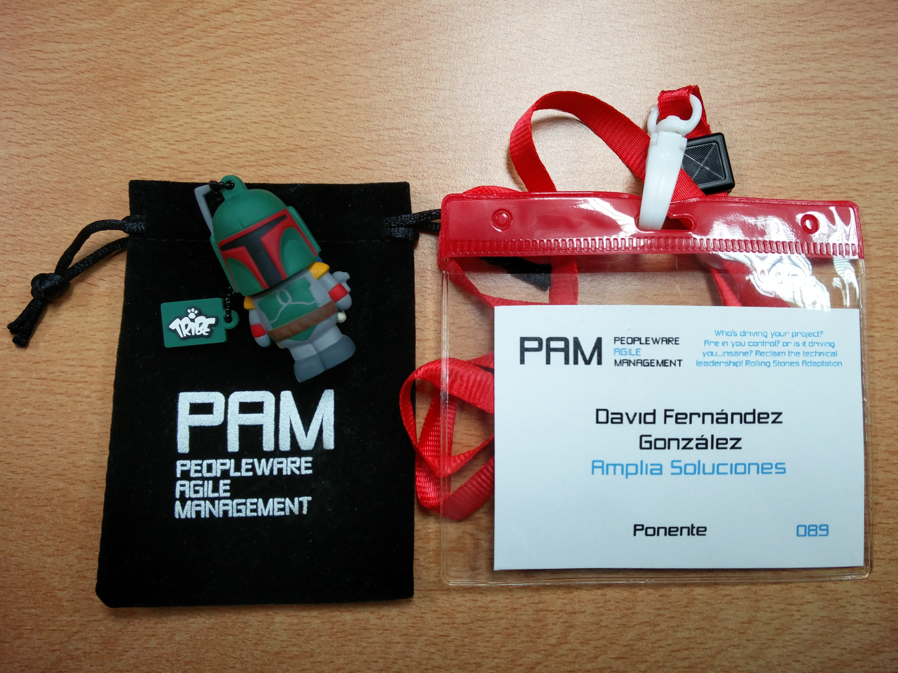
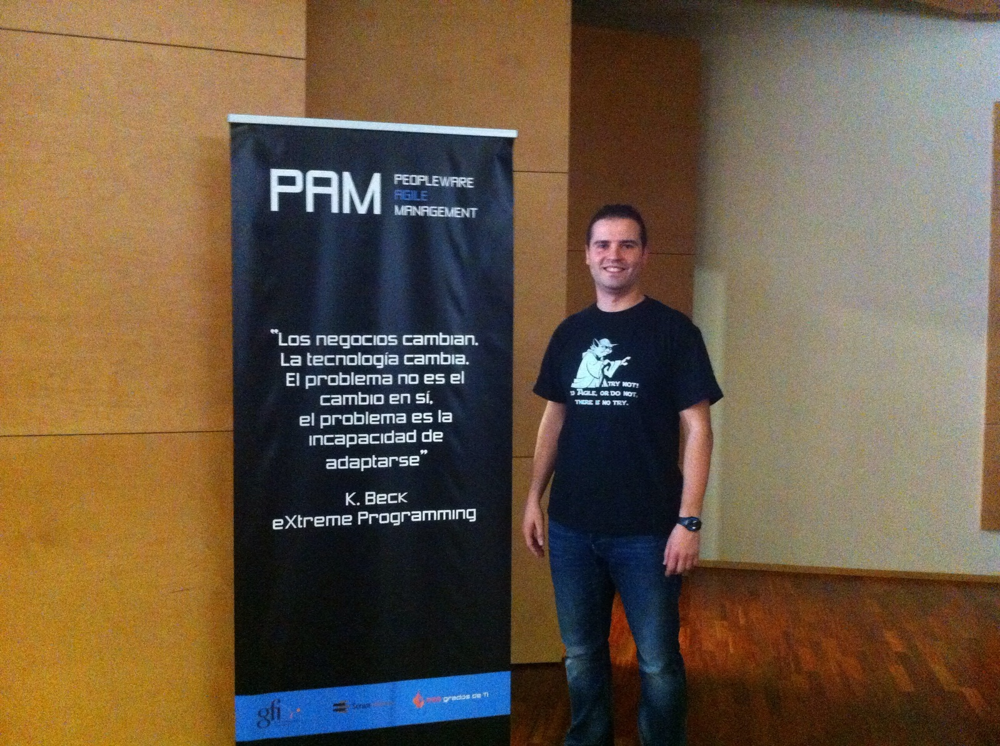



_First of all, sorry for my English. Any correction is well received._

On Thursday October 22, 2015 was the first edition of the day [Peopleware Agile Management](http://peopleware-agilemanagement.com/).

**I was pleased to have been chosen as one of the speakers at the first edition**,  the day was dedicated to anyone who (and I quote from what the organization said):

* "Manage" or coordinates software teams, leading his/her people to take their full potential, be motivated, and overcome every software project successfully, in the best way possible.
* Is worried by motivation and personal growth of your peers, your team, your employees.
* Helps to promote continuous improvement in your company, has managed changes in the daily lives of the team, software process improvement, etc.
* Make selection processes of computer profiles (developers, systems, testers, etc.) and look for the best people for your company.
* Find ways to spread knowledge among the members of your team.
* Work to break down communication barriers between different profiles of the teams, to break the barriers of communication with the management of the company or the customer.
* Is worried about promote the creation of software teams with people that complement each other.
* Encourage teamwork and quality.
* Looking for provide the greatest value to customers.
* etc.

The general feeling throughout the day are very positive, as speaker and as an assistant.

There were talks of great interest, but I only could see half of them because there were two parallel tracks.

I would emphasize the talk of [David Thomas](https://twitter.com/davidtomas) "The 11 keys to a happy company" in which he showed us how his company make the things and that leads us to think that exists a way to do everything differently and more human way, thinking about the welfare of employees.

And I usually classify the talks into 3 groups:

* The talks of those that normally to speak in public as (in order of appearance in the conference) [Javier Garzás](https://twitter.com/jgarzas), [Jesus Hernando](https://twitter.com/jhcorrochano) or [David Roncero](https://twitter.com/davidroncero_es) ... also I heard about [Domingo Gaitero](https://twitter.com/DgaiteroG), but I could not see him because I was in the other track room.
* The talks of those who already have some professional experience, know what they say, but lack what might be the domain of the stage. Personally I look a bit in this group, but it is only my point of view ;)
* And finally, the talks of people with less experience and not surprisingly, are often noted some nervousness. Nevertheless, it should be noted that everyone executed its talk with dignity.

Considering it was the first edition, there is not much to demand and the only downside that maybe I could say, it is with regard to planning. The time was too short to go to the other hall, go to the cafeteria or something more mundane like going through the bathroom. Perhaps removing a talk could be enough, those 30 minutes would be distributed among the other talks to have some more leeway, but hey, in the PAM2016 sure everything will go even better.

**The title of my talk I was "I'm a person (not just a resource)"** and despite the nerves before the talk, the presentation went pretty well and I'm very satisfied with the result. You can have a look at the video of the talk and also [the slides]({{ BASE_PATH }}/charlas/soy_persona_no_soy_recurso/index.html).

<iframe width="520" height="385" 
src="http://www.youtube.com/embed/oYVQwdaHs9Q">
</iframe>
 

If someone was left wanting more, **I have the honor to be present in the [Agile Spain Conference 2015 (CAS2015)](http://cas2015.agile-spain.org/) (In Madrid on Friday, December 4 at 12:00, at the Circulo de Bellas Artes)** with the same speech, but in the format of 40 minutes. I touch a few things from the 20-minute version of that presented in the PAM2015 and I will have more time to adapt the speech to go slowest and develop in some aspects.

And little more, only to congratulate the organization because it is not easy to manage a conference for 202 attendees.

See you at the PAM2016!