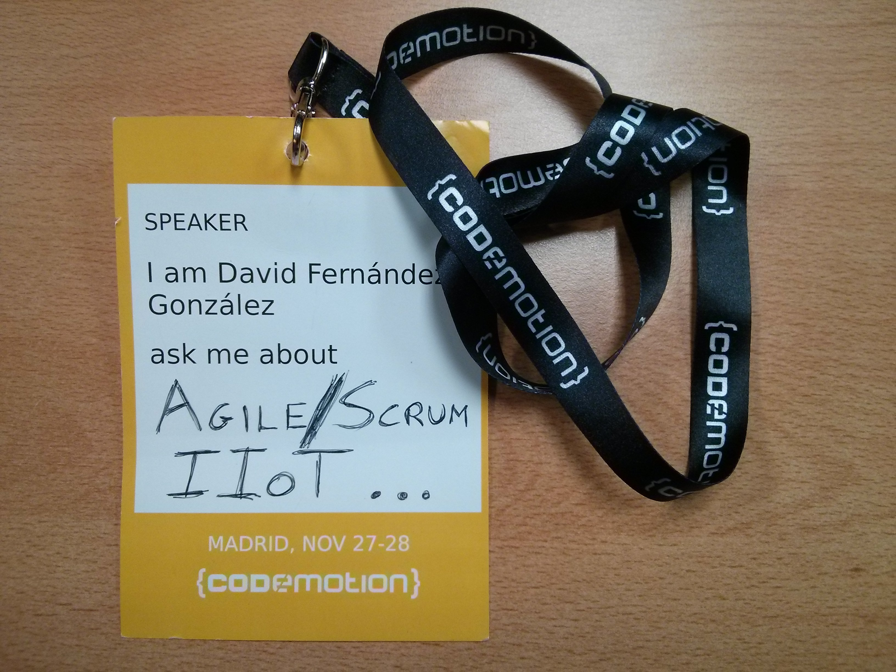



_First of all, sorry for my English. Any correction is well received._

In last November, specifically on Friday 27 and Saturday 28, it took place in Madrid the fourth edition of [Codemotion](http://2015.codemotion.es/).

`Codemotion` is an event that could be defined as multi-language and multi-platform, that gathers many communities. In numbers, as advertised on their website:

* \+ `1900 attendants`. The more massive IT event in Spain.
* \+ `30 communities` involved.
* `130 talks and workshops`.

In the first two editions I had attended as a spectator but this year, that I'm going out of my comfort zone doing talks and presentations, I encouraged myself to submit two proposals:

* One about Internet of Things Industrial, more related with my company, and together with my colleague and friend [Carlos Prados](https://twitter.com/carlosprados).
* And another, that from has long I had in mind, more personal and related with Scrum.

The truth is he did not know how easy or difficult it is to be elected and to my delight and surprise both talks were selected. The first for Friday and the second on Saturday.

## The arrival

On Friday we arrived early to check in and already the great atmosphere in these events was seen: many people in the halls commenting about the merchandising (here I would highlight the cup that was given to the speakers and I didn't delayed too much the use of the cup, only until Sunday breakfast), the stands of the various sponsors with games, shows, advertising, etc.

And once equipped with the passes and welcome bags was time to see some talks before we took our turn...

## The talks

The truth is that the large number of talks, implies that there is a bit of everything. I once heard something that once experienced I think it is useful. Choose the talks by the speaker. If you know a rapporteur for other events, other years and he has convinced you, **it is very likely that another of his talks will be fine for you**, and that's vital to not feel like you're wasting your time. In fact, I personally prefer to spend time entertaining and learn something less than being in a boring chat with many new knowledge that could acquire, but this is personal taste.

The fact is that many talks do not go into too much detail and could be considered to be low-average level, so attend any of a topic you know, it may be a waste of time for you.

In short, my **recommendations for choosing a talk** are 2 and in order of preference:

1. **Talk choose by speaker**. Because if you've already heard the rapporteur, would you know or have good references from him.
2. **Choose talks of unkown topics for you**, so they can bring you something.

Regarding the talks that I watched, there were only a couple of them worth mentioning:

* *DevOps Mashup. Microservices, KLA, and Continuous Delivery Cloud.* de [Ramon Roman Nissen](https://twitter.com/rromannissen) and [Ignacio Sanchez Gines](https://twitter.com/drhelius). Well prepared and very useful practical example.
* **And certainly the talk that should be noted and closed the day at Track 1 *Blues* of [Chema Alonso](https://twitter.com/chemaalonso)**. Probably the most mediatic Computer Engineer in Spain and he shows his experience as a speaker. No doubt that his fluency in the show that made us makes it clear that he is still coding. The talk was enlivened with music of [Platero and you](https://es.wikipedia.org/wiki/Platero_y_T%C3%BA) and he left an enigmatic message as it seems he is going to take a break of conferences and enjoy more the family. By putting some but would have to say that during his speech he spoke well of MongoDB (because that's what I was using the application that was presenting us) in reference to a previous speaker who criticized this database. Well ... the joke would be fine in perspective, but I think that he also lost the reason why he said. He said that they were doing Big Data and they only have about 4 and a half million applications in the database...and we have Big Data if we are talking of several Teras of information...and those 4 million and gives me the impression that they are quite short.

## Our talk: *Industrial Internet Of Things applied to Energy Efficiency*

The feeling was very good, and the post-talk comments were positive so it seems that we meet our objectives: to make a nice talk and convey our vision of the Industrial Internet of Things (IIoT).

The beginning was difficult, since I placed my team on the stand, I left the slides placed on the projector and as it was early Carlos Prados was "guarding" while I went to the bathroom. When I came back I found with two surprises, one positive and one negative:

1. The positive was that the room was closed, yes, yes, it was closed because they no longer fit more people in (this was one of the spots throughout the Codemotion because the rooms looked like they were small for the amount of people we were) so happy that at least the talk was interesting enough to attract the public.

2. And negative ... my computer was dead!! it had off and no way to revive ... luckily Carlos also led his computer as Backup.

About the presentation, I think there is no better explanation that show you how was the thing so I leave you both video and slides of the talk:

* The video:

<iframe width="520" height="385"
src="http://www.youtube.com/embed/kOXBqqfsUv4">
</iframe>
 

* The slides:

<iframe src="//www.slideshare.net/slideshow/embed_code/key/7lHoYSJCvJH6Ct" width="595" height="485" frameborder="0" marginwidth="0" marginheight="0" scrolling="no" style="border:1px solid #CCC; border-width:1px; margin-bottom:5px; max-width: 100%;" allowfullscreen> </iframe> 
 <strong> <a href="//www.slideshare.net/DavidFernndezGonzlez3/codemotionmadrid-20151128charla-internet-de-las-cosas-industrial-aplicado-a-eficiencia-energticadavid-ferandez-gonzlez-y-carlos-javier-prados-hijn" title="Codemotion|Madrid 2015-11-28|Charla: Internet de las cosas industrial aplicado a Eficiencia Energética|David Ferńandez González y Carlos Javier Prados Hijón" target="_blank">Codemotion|Madrid 2015-11-28|Talk: Industrial Internet Of Things applied to Energy Efficiency[In Spanish]|David Ferńandez González y Carlos Javier Prados Hijón</a> </strong> from <strong><a href="//www.slideshare.net/DavidFernndezGonzlez3" target="_blank">David Fernández González</a></strong> 

## Feedback

All comments are positive and **the organization enabled [the possibility of giving feedback of the talk](http://2015.codemotion.es/agenda.html#5677904553836544/48544002)**, which it is useful to correct or confirm what works and what you have to improve. Also in that same link they allow us to link to the slides and the video of the talk (if you have the video, since the organization had managed only recording 3 of the 8 tracks).

And with a good impression, the first day was over ... I went home to rest and regain strength for [Saturday]({{ BASE_PATH }}/en/2015-12-15-codemotion-2015-2.html).

