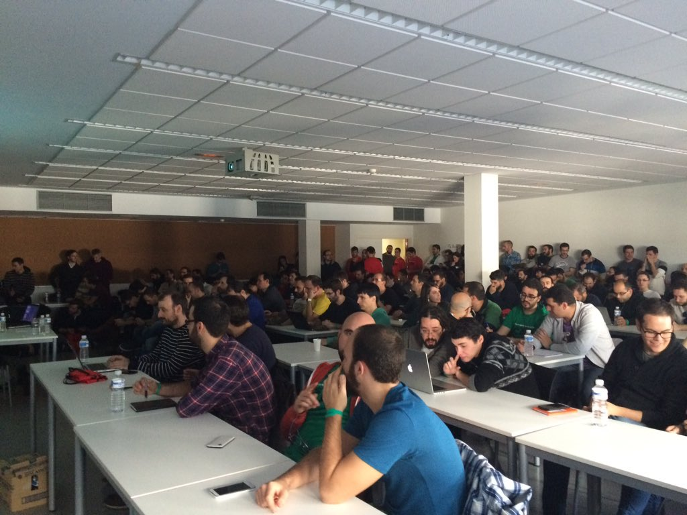
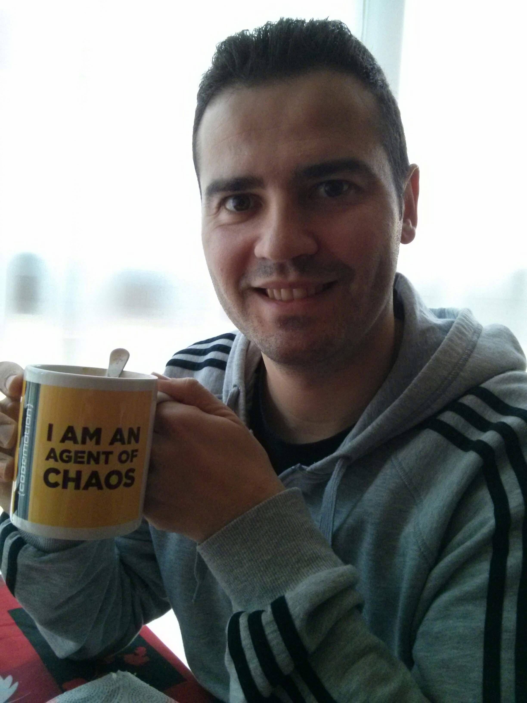



_First of all, sorry for my English. Any correction is well received._

Well, after [Codemotion Friday's session]({{ BASE_PATH }}/en/2015-12-15-codemotion-2015-1.html) Saturday came where I faced with great enthusiasm my talk alone: ["Scrum Wars: Gutting Scrum (utopias and realities)"](http://2015.codemotion.es/agenda.html#5699289732874240/50514005).

## My talk: "*Scrum Wars: Gutting Scrum (utopias and realities)*"

Long ago I had in mind a talk in which show the problems, the impediments and obstacles that arise when implementing or using Scrum. And knowing that we do not live in the `World Utopía`, also show some options and solutions that can be performed at the`Real World` to overcome some of these difficulties.

The presence and support of several colleagues and friends helped and my nerves were calmer.

The talk could start 10 minutes before the hour, because **15 minutes before the scheduled time and had the packed room!!**. I have to thank the attendees for their interest, because there were lot of people who had to sit on the floor of the different gaps that were between the tables, and many others who were all talk standing, filling the sides and background of the hall.

A pity that in that room there weren't microphone and speakers, because my voice perhaps didn't go with all the clarity. In fact, the video that follows had to be edited to improve the sound intensity (I take this opportunity to thank [Jorge Bernal](https://twitter.com/GiorTM) for the edition).

The experience was great, the audience was delivered from minute 0 and enjoyed the talk as a dwarf (It's a Spanish expression). I think in the video you can see that both myself and the audience enjoyed it a lot.

* The video:

<iframe width="520" height="385"
src="http://www.youtube.com/embed/8IC0Gjbj-vY">
</iframe>
 

* The slides:

<iframe src="//es.slideshare.net/slideshow/embed_code/key/a3sUM6nM2Udmt1" width="595" height="485" frameborder="0" marginwidth="0" marginheight="0" scrolling="no" style="border:1px solid #CCC; border-width:1px; margin-bottom:5px; max-width: 100%;" allowfullscreen> </iframe> 
 <strong> <a href="//es.slideshare.net/DavidFernndezGonzlez3/codemotionmadrid-20151128charla-scrum-wars-destripando-scrum-utopas-y-realidadesdavid-fernndez-gonzlez" title="Codemotion|Madrid 2015-11-28|Charla: Scrum Wars: Destripando Scrum (Utopías y realidades)|David Fernández González" target="_blank">Codemotion|Madrid 2015-11-28|Talk: Scrum Wars: Gutting Scrum (utopias and realities)[In Spanish]|David Fernández González</a> </strong> from <strong><a href="//www.slideshare.net/DavidFernndezGonzlez3" target="_blank">David Fernández González</a></strong> 

On Saturday I had no time to attend to other talks, since my mother was visiting and in life there are always priorities). So I went to enjoy the day with my women: my mother, my wife and daughter (best possible company).

## Feedback

As I have commented on the previous post, all feedback about the talk are positive and **in the the event website have been enabled  [the possibility of give us feedback](http://2015.codemotion.es/agenda.html#5699289732874240/50514005)**, which it is useful to correct or confirm what works and what you have to improve. Also in that same link they allow us to link to the slides and the video of the talk.

## End of the Codemotion 2015 experience

And finally, I leave a picture of Sunday morning where I premiered  the cup that the organization gave to the speakers. I feel proud and satisfied of the two talks and to be considered an "Agent of Chaos".

My first Codemotion as speaker has a very positive balance and I am very happy for the experience.

Now it is time to rest and think about some new talks for next year's edition. Do you have any proposal that interests you and in which I can inspire?
